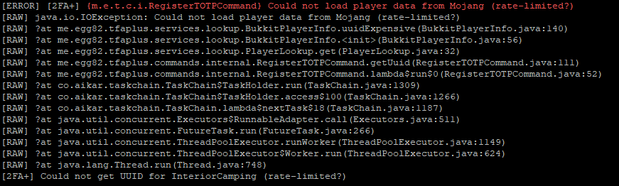
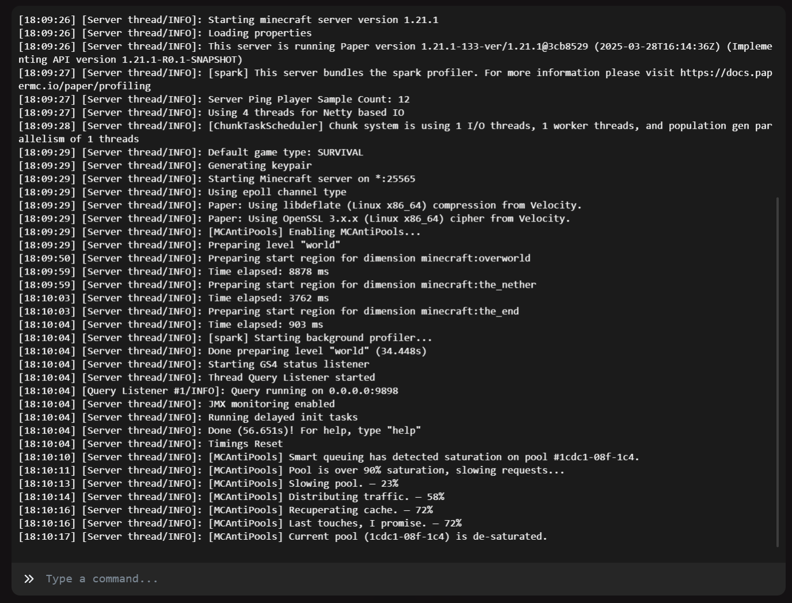

**🌐 » Reliable Mojang's pools session handling, get rid of lag.**

[📥 Download](https://github.com/PoolSync-Studios/MCAntiPools/releases) • [📖 About us](https://github.com/PoolSync-Studios/)

## 🔎 » What is MCAntiPools?

MCAntiPools eliminates **HTTP 429 rate limiting issues** that cause:
- ❌ Random player disconnections
- ❌ Login failures 
- ❌ Sudden lag spikes
- ❌ Session validation timeouts
- ❌ Server crashes

**PoolSync's Solution** *(us)*: Intelligent connection pooling, smart request queuing, and advanced caching.

---

| 📍 **People having errors:** | 📊 **Our fix!** |
|:---:|:---:|
|  |  |

---

## ❓ » But... how is it possible?

> You see, we use different methods to prevent this...
- 🔧 ― Multi-pool system that spreads traffic across several connection pools for better performance.
- 🧠 ― Smart rate limiting adapts to server load and prioritizes important requests.
- 💾 ― Flexible caching with support for memory, Redis, or database backends.
- 📊 ― Live monitoring lets you track performance and receive instant alerts.
- 🛡️ ― Built-in protection handles retries and fallback gracefully to keep players online.
- 🌐 ― Cross-server caching lets multiple servers share the same cache seamlessly.
> *(yes, the emojis are also included in the prevention fixes 😂)*

## 🛠️ Quick Setup

> [!NOTE]
> You will need:
> - Minecraft 1.17 - 1.21+ (Spigot/Paper/Purpur/Bukkit...)
> - Java 17+

### 🔱 ― Easy Install *(yes, actually)*
1. Download from [Releases](https://github.com/PoolSync-Studios/MCAntiPools/releases)
2. Drop in `plugins` folder
3. Restart server
4. You're done, no need in doing config checks, weird commands.
5. MCAntiPools will start working **when it detects pool saturation**.

## ⚙️ Current issues!

> [!WARNING]
> Some users reported sometimes the config doesn't automatically appear.
> Don't worry, the plugin **WILL STILL WORK** and **doesn't need** HUMAN INTERVENTION.

## 🔗 Integrations *(SOON)*

- [ ] **PlaceholderAPI**: Display statistics in chat/scoreboards
- [ ] **LuckPerms**: Advanced permission management  
- [ ] **DiscordSRV**: Discord notifications for events

## 📄 License

MCAntiPools is licensed under the **MIT License**. See [LICENSE](LICENSE) for details.

---

**Made with ❤️ by the PoolSync Studios.**

